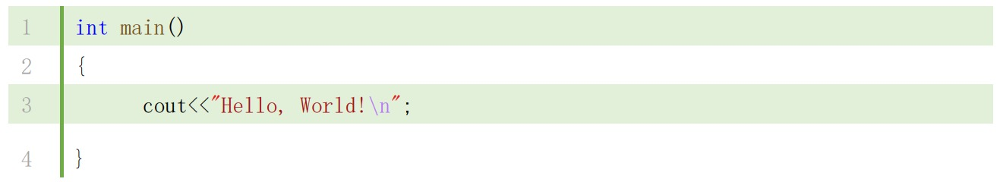
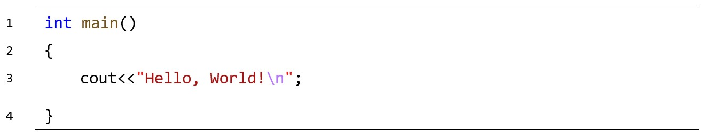
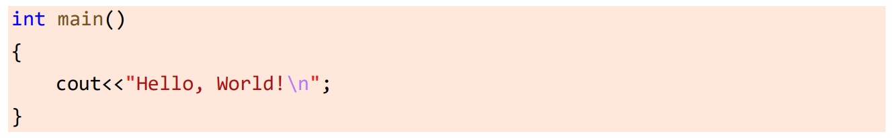
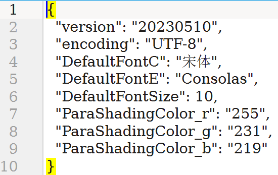

# fdscend_word_addin
1. 在Word中一键实现代码排版
2. 本插件为预览版，仍存在许多bug，使用中请注意及时保存文档，
3. 欢迎提交使用反馈，帮助插件的改进。

# 使用环境
1. 系统：Windows 10+ （win10 以下未测试，不保证可使用）
2. 仅支持Microsoft Word桌面版，建议Office2019版本以上（测试有限，不确定最低在哪个Word版本能正常使用）
3. 经测试WPS不完全兼容，所以安装包没有写入WPS

# 使用方法
1. 点击“增加”

2. 在弹窗中输入操作码（操作码见后文）

3. 选项卡功能示意图（不代表实际功能）

# 操作码
*由于一些功能在完善中，暂时无法正常使用，所以通过操作码仅开放能够正常使用的功能*
**可用操作码**
代码样式1：`code`
代码样式2：`codeL`
代码样式3：`codeB`
工具箱：`tools`

# 代码排版效果
本插件实现了以下三种代码排版样式。使用方法均为：选中代码，点击对应“一键排版”按键。
**注意**：本插件没有高亮代码的功能。直接从代码窗复制，保留原格式粘贴到Word可以保留高亮。

## 代码样式1

[实现原理](https://www.bilibili.com/video/BV1Br4y1u748)

## 代码样式1

[实现原理](https://www.bilibili.com/video/BV1Fe4y1P7RV)

## 代码样式3

# 自定义设置与预设
在ProgramData目录下（通常是C:\ProgramData\分点作答\FDscend），有插件所有的设置文件

1. 由于各种因素，暂未在插件选项卡中对各项设置实现全部自定义，但是基本所有选项都可以在预设文件中进行修改。
2. 修改时请使用UTF-8编码，以及相应数字或者字符串类型。
3. 建议：在修改预设文件前先备份。

# 关于源代码

## 如何使用
- 请遵循项目开源协议
- 建议使用release模式，不会显示未完成部分。debug模式会显示所有功能，容易触发bug。
  - release模式需要将[预设文件7z](doc/settings.7z)解压至ProgramData目录，如其中的Config子文件夹应当在`C:\ProgramData\分点作答\FDscend\Config`
  - debug模式需要将工程放置于`D:\code\WordAddIn1\WordAddIn1.sln`。（由于项目使用了绝对路径）

## 一些不重要的说明（可以跳过）
- 这个项目是我入门编程过程中的作品，并且在这个项目之前完全没接触过c#
- 项目时间跨度比较大，代码有很多前后不统一的情况。比如一开始使用拼音命名，后来才意识到变量命名的问题，又陆续用来驼峰、下划线……挺混乱的，然后也懒得改了……
- 由于没学过c#，所以从各大网站cv了大量代码，属于是一边看一边学。
- 项目一开始只是想做一种Word中一键排版代码的功能，实现效果就是样式1，方法很简单，Word本身就能实现，我只不过放到一个按键里。
- 后来就零零散散地写一些我常用的，但Word实现起来麻烦的功能。总之是属于自己用的舒服就行，所以很多问题就没进行完善了（代码能跑就行x）

# 警告：有比较严重缺陷的功能
- 工具箱 -> 标签栏：切换文档时可能会出现标签栏为竖向
