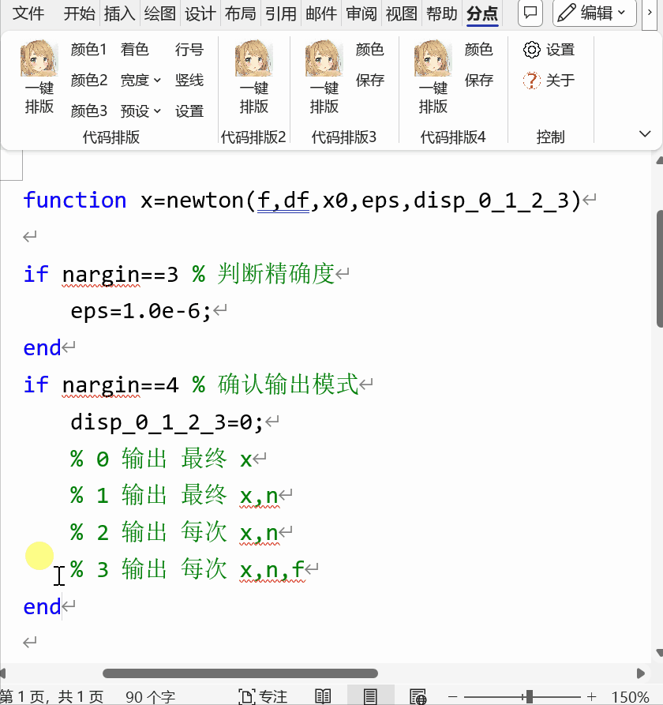
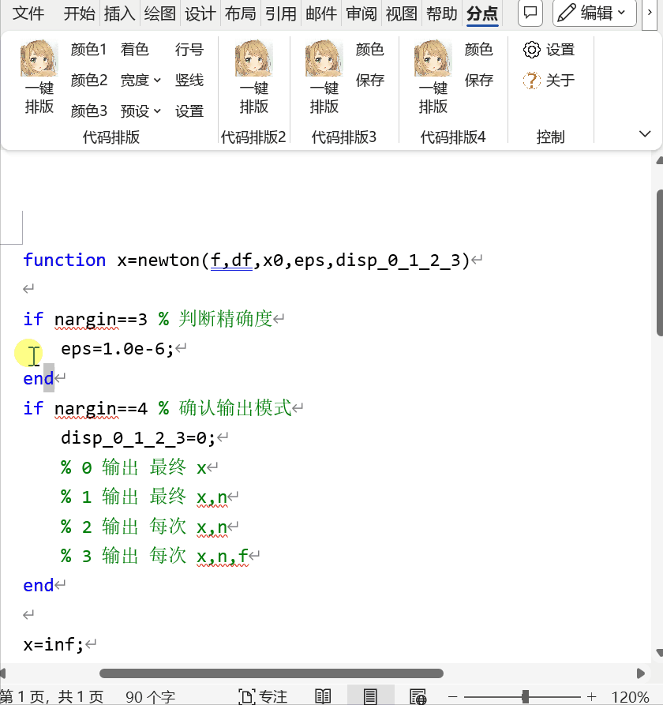
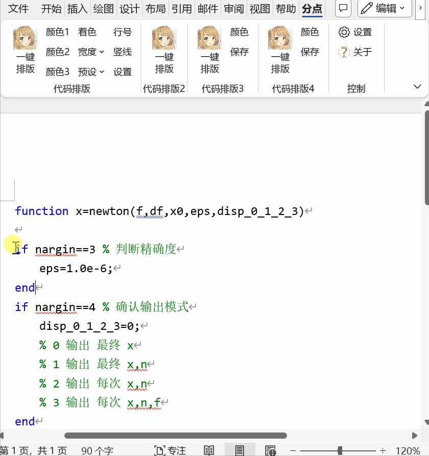

# fdscend_word_addin
1. 在Word中一键实现代码排版
2. 本插件为预览版，仍存在许多bug，使用中请注意及时保存文档，
3. 欢迎提交使用反馈，帮助插件的改进。

# 实现功能
- 【代码排版】
   - 四种排版样式，样式参见后文gif展示。功能支持修改预设文件实现不同程度的自定义
- 【文案】功能区
   - 简单的标题正文格式，并支持样式自定义
   - 使用预设的页眉、页脚
   - 页眉插入当天时间
   - 文末插入自定义署名（支持自动读取Office署名、wps署名、计算机用户名，支持自定义预设署名）
   - 输入微信公众号文章链接，插入文章封面图
   - 输入bilibili视频、直播间链接，插入封面图
- 【工具箱】功能区
   - 一键给段落底纹上色，并支持颜色自定义
   - 一键修改样式底纹颜色，并支持颜色自定义
   - 简单给表格上色，支持修改预设文件
   - 表格改成三线表（不支持含合并单元格的表格）
   - 标签栏（暂时有点小问题~）
   - 批量替换符合，支持自定义
   - 批量检查符合配对，支持自定义
   - 批量删除页眉横线
   - 行间代码排版，效果类似markdown的行间代码
   - BibTeX 转 GB/T7714-2015 格式
   - 代码高亮（需要 webView2 runtime）
- 【运行代码】功能区 ~~Word is a code editor~~
   - 选中文档中的代码，点击运行，可以在代码下方输出打印文字
   - 支持运行 Python, R, Java（需要相应的环境）

# 使用环境
1. 系统：Windows 10+ （win10 以下未测试，不保证可使用）
2. 仅支持Microsoft Word桌面版，建议Office2019版本以上（测试有限，不确定最低在哪个Word版本能正常使用）
3. 经测试WPS不完全兼容，所以安装包没有写入WPS

# 使用方法
1. 点击“设置”

2. 在弹窗中输入操作码（操作码见后文）

3. 选项卡功能示意图（不代表实际功能）

# 操作码
*由于一些功能在完善中，暂时无法正常使用，所以通过操作码仅开放能够正常使用的功能*

**可用操作码**

- 代码样式1：`code`
- 代码样式2：`codeL`
- 代码样式3：`codeB`
- 代码样式4：`code4`
- 文案：`xmt`
- 工具箱：`tools`

# 代码排版效果
本插件实现了以下三种代码排版样式。使用方法均为：选中代码，点击对应“一键排版”按键。
**注意**：本插件没有高亮代码的功能。直接从代码窗复制，保留原格式粘贴到Word可以保留高亮。

## 代码样式1

[实现原理](https://www.bilibili.com/video/BV1Br4y1u748)

## 代码样式2

[实现原理](https://www.bilibili.com/video/BV1Fe4y1P7RV)

## 代码样式3

## 代码样式4

# 自定义设置与预设
在ProgramData目录下（通常是C:\ProgramData\分点作答\FDscend），有插件所有的设置文件

1. 由于各种因素，暂未在插件选项卡中对各项设置实现全部自定义，但是基本所有选项都可以在预设文件中进行修改。
2. 修改时请使用UTF-8编码，以及相应数字或者字符串类型。
3. 建议：在修改预设文件前先备份。

# 关于源代码

- 请遵循项目开源协议
- 建议使用release模式，不会显示未完成部分。debug模式会显示所有功能，容易触发bug。
  - release模式需要将[预设文件7z](doc/settings.7z)解压至ProgramData目录，如其中的Config子文件夹应当在`C:\ProgramData\分点作答\FDscend\Config`
  - 由于项目使用了绝对路径，debug模式需要将工程放置于`D:\code\WordAddIn1\WordAddIn1.sln`。或者在 `Ribbon1.cs` 中修改 `FDscendHome` 的值（项目版本v0.15.0+）

# 一些特性
- v0.17.0+
  - 【工具箱->BibTeX】【文案->获取封面（b站）】功能已打包，无 Python 环境也能运行。注：可在【控制->设置】中勾选“使用 Python 脚本”重新启用功能相应的脚本
- v0.16.0
  - 【文案】 中的“文章标题”“一级标题”“二级标题”“正文格式”功能开放自定义，在 `FDscend\Presets\XMT_style.docx` 中修改样式即可。（注意此功能不能在未创建的文档中使用）
  - 【工具箱->BibTeX】功能需要python 3.10+环境，运行 `FDscend/scripts/` 文件夹下的python文件。此功能的更多信息参见 [GitHub - FDscend/bibtex2gbt7714: 使用 Python 将 BibTeX 文件转换为 GB/T7714-2015 格式，支持可视操作、单一命令行、批量命令行](https://github.com/FDscend/bibtex2gbt7714)

- v0.15.0+
  - 【文案->获取封面（b站）】功能需要python环境，运行 `FDscend/scripts/` 文件夹下的python文件。（由于未知原因，用c#写的代码给出乱码，所以只好先用python实现一下）

- v0.13.1+
  - 工具箱 -> 标签栏：关闭文档后无法正常显示标签栏。临时应急方法：可以重新通过按键打开标签栏，或者先点一下别的窗口（比如随便一个文件夹）再回到Word。
