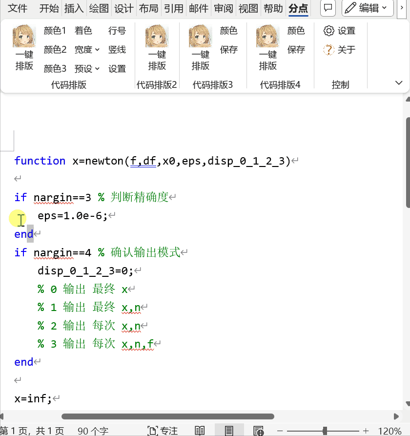

# [fdscend_word_addin](https://github.com/FDscend/fdscend_word_addin)

1. 本插件为预览版，仍存在许多 bug，使用中请注意及时保存文档，
2. 欢迎提交使用反馈，帮助插件的改进。

# 实现功能

- 【代码排版】
  - 四种排版样式，样式参见后文 [gif 展示](#代码排版效果)。功能支持修改预设文件实现不同程度的自定义
- 【文案】功能区
  - 简单的标题正文格式，并支持样式自定义（可切换不同预设）
  - 使用预设的页眉、页脚
  - 页眉插入当天时间
  - 文末插入自定义署名（支持自动读取 Office 署名、wps 署名、计算机用户名，支持自定义预设署名）
  - 输入微信公众号文章链接，插入文章封面图
  - 输入 bilibili 视频、直播间链接，插入封面图
- 【工具箱】功能区
  - 一键给段落底纹上色，并支持颜色自定义
  - 一键修改样式底纹颜色，并支持颜色自定义
  - 简单给表格上色，支持修改预设文件
  - 表格改成三线表（不支持含合并单元格的表格）
  - 批量替换符合，支持自定义
  - 批量检查符合配对，支持自定义
  - 批量删除页眉横线
  - 行间代码排版，效果类似 markdown 的行间代码
  - BibTeX 转 GB/T7714-2015 格式
  - 代码高亮
- 【PDF 工具箱】
  - 将 PDF 文件逐页转换为图片
  - 将多张图片转换为一份 PDF 文件
  - 将 PDF 转换为图像版 PDF （每一页都是一张图片，文字将不可选中复制）
- 【公式编号】
  - 四种公式编号样式，样式参见后文 [gif 展示](#公式编号样式)。
- 【运行代码】功能区 ~~Word is a code editor~~ :)
  - 选中文档中的代码，点击运行，可以在代码下方输出打印文字
  - 支持运行 Python, R, Java（需要相应的环境）
- 【简单浏览器】
  - 在侧栏浏览在线网页，支持一键切换电脑、手机模式
  - 在侧栏预览本地 HTML, PDF, Markdown
- 【实验性功能】
  - 标签栏（暂时有点小问题~）

# 使用环境

1. 系统：Windows 10+ （win10 以下未测试，不保证可使用）
2. 仅支持 Microsoft Word 桌面版，建议 Office2019 版本以上（测试有限，不确定最低在哪个 Word 版本能正常使用）
3. 经测试 WPS 不完全兼容，所以安装包没有写入 WPS

# 使用方法

> - 在 **v0.19.0** 版本以上，安装插件即可使用，不需要手动输入操作码（如果没有显示功能区，可以参照以下步骤输入操作码，或卸载重装。
> - 对于不想使用的功能区，可以在设置中取消勾选

1. 点击“设置”

   

2. 在弹窗中输入操作码（操作码见[后文](#操作码)）

   

3. 选项卡功能示意图（不代表实际功能）

   

# 操作码

_由于一些功能在完善中，暂时无法正常使用，所以通过操作码仅开放能够正常使用的功能_

**可用操作码**

- 代码样式 1：`code`
- 代码样式 2：`codeL`
- 代码样式 3：`codeB`
- 代码样式 4：`code4`
- 文案：`xmt`
- 工具箱：`tools`
- PDF 工具箱：`pdf`
- 公式编号：`math`
- 运行代码：`runCode`
- 简单浏览器：`browser`

# 代码排版效果

本插件实现了以下四种代码排版样式。使用方法均为：选中代码，点击对应“一键排版”按键。

**注意**：本插件没有直接高亮代码的功能。

1. 直接从代码窗复制，保留原格式粘贴到 Word 可以保留高亮。
2. 使用“代码高亮”功能（实验性）

## 代码样式 1

[实现原理](https://www.bilibili.com/video/BV1Br4y1u748)

## 代码样式 2

[实现原理](https://www.bilibili.com/video/BV1Fe4y1P7RV)

## 代码样式 3

## 代码样式 4

# 公式编号样式

## 模式 1

> 交叉引用，给编号打书签，引用书签

## 模式 2

> 交叉引用，选“段落编号”

## 模式 3

> 交叉引用，给编号打书签，引用书签

## 模式 4

> 交叉引用，选“段落编号”

# 自定义设置与预设

在 ProgramData 目录下（通常是 `C:\ProgramData\FDscend`），有插件所有的设置文件

1. 由于各种因素，暂未在插件选项卡中对各项设置实现全部自定义，但是基本所有选项都可以在预设文件中进行修改。
2. 修改时请使用 UTF-8 编码，以及相应数字或者字符串类型。
3. 建议：在修改预设文件前先备份。

# 关于源代码

- 请遵循项目开源协议
- 建议使用 release 模式，不会显示未完成部分。debug 模式会显示所有功能，容易触发 bug。
  - release 模式需要将[FDscend 文件夹](/FDscend/)复制至 ProgramData 目录，如其中的 Config 子文件夹应当在`C:\ProgramData\FDscend\Config`
  - 由于项目使用了绝对路径，debug 模式需要将工程放置于`D:\code\WordAddIn1\WordAddIn1.sln`。或者在 `Ribbon1.cs` 中修改 `FDscendHome` 的值（项目版本 v0.15.0+）

# 一些特性

- v0.19.0
  - 【PDF 工具箱】如果使用 Python 脚本，需要本地有 fitz, PIL 库（`pip install PyMuPDF pillow`）
- v0.17.0+
  - 【工具箱->BibTeX】【文案->获取封面（b 站）】功能已打包，无 Python 环境也能运行。注：可在【控制->设置】中勾选“使用 Python 脚本”重新启用功能相应的脚本
- v0.16.0

  - 【文案】 中的“文章标题”“一级标题”“二级标题”“正文格式”功能开放自定义，在 `FDscend\Presets\XMT_style.docx` 中修改样式即可。（注意此功能不能在未创建的文档中使用）
  - 【工具箱->BibTeX】功能需要 python 3.10+环境，运行 `FDscend/scripts/` 文件夹下的 python 文件。此功能的更多信息参见 [GitHub - FDscend/bibtex2gbt7714: 使用 Python 将 BibTeX 文件转换为 GB/T7714-2015 格式，支持可视操作、单一命令行、批量命令行](https://github.com/FDscend/bibtex2gbt7714)

- v0.15.0+

  - 【文案->获取封面（b 站）】功能需要 python 环境，运行 `FDscend/scripts/` 文件夹下的 python 文件。（由于未知原因，用 c#写的代码给出乱码，所以只好先用 python 实现一下）

- v0.13.1+
  - 工具箱 -> 标签栏：关闭文档后无法正常显示标签栏。临时应急方法：可以重新通过按键打开标签栏，或者先点一下别的窗口（比如随便一个文件夹）再回到 Word。
